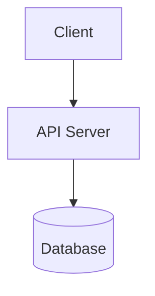

# opencode-mermaid

OpenCode plugin — renders Mermaid diagrams **inline in chat** as SVG images with collapsible source view. No external browser tab, no ASCII approximations.



↑ AI writes a ` ```mermaid ` block and it instantly becomes a **visible diagram in the chat flow**.

---

## Install

```jsonc
// .opencode/opencode.json
{
  "plugin": ["goupdate/opencode-mermaid@latest"]
}
```

OpenCode installs it automatically on next start. No config needed.

---

## Usage

1. Start a conversation with the AI
2. Ask for a diagram — the system prompt tells the AI it can use ` ```mermaid ` blocks
3. The plugin auto-detects mermaid blocks and renders them as **inline SVG images**
4. Click **"📝 Mermaid source"** to reveal the original source code

No tool calls. No external browser. Just write ` ```mermaid ` and it renders.

---

## Supported diagram types

| Type | Syntax | Status |
|---|---|---|
| Flowchart | `graph TD`, `flowchart LR`, etc. | ✅ |
| Sequence | `sequenceDiagram` | ✅ |
| Class | `classDiagram` | ✅ |
| State | `stateDiagram-v2` | ✅ |
| ER | `erDiagram` | ✅ |
| Pie | `pie` | ❌ (v0.1) |
| Gantt | `gantt` | ❌ (v0.1) |
| Mindmap | `mindmap` | ❌ (v0.1) |
| Timeline | `timeline` | ❌ (v0.1) |
| Git Graph | `gitGraph` | ❌ (v0.1) |

Unsupported types fall back to showing the original ` ```mermaid ` block unchanged.

---

## How it works

```
AI writes ```mermaid block
        │
        ▼
experimental.text.complete hook intercepts output
        │
        ▼
beautiful-mermaid renders Mermaid → SVG string
        │
        ▼
SVG → base64 data URL → 
        │
        ▼
+ <details> block with collapsible source code
```

---

## Security

- **Zero network requests** — all rendering is local
- **No external CDN** — SVG embedded as data URL, no third-party resources
- **No file system access** — plugin doesn't read/write any files
- **HTML-escaped** — source code is properly escaped before rendering
- **Minimal dependencies** — one runtime dependency

---

## Development

```bash
bun install
bun test        # 23 tests
bun test --watch
```

### Run a test instance

```bash
opencode web --port 4090
```

Opens a second OpenCode instance on port 4090 with no other plugins active — ideal for plugin development.

---

## License

MIT

---

Built on [beautiful-mermaid](https://github.com/lukilabs/beautiful-mermaid) for server-side SVG rendering and [OpenCode Plugin API](https://opencode.ai) for chat integration. Thanks to these projects for laying the foundation.